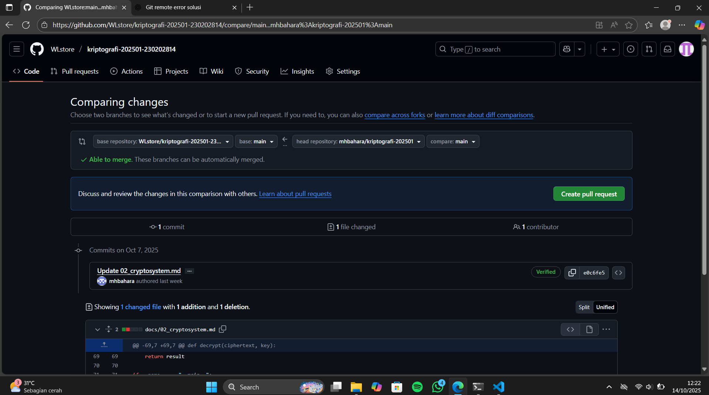

Minggu ke-: 1
Topik: Intro CIA
Nama: Lukman Wahyu Permadi
NIM: 230202814
Kelas: 5IKRB
# Laporan Minggu 1

Ringkasan Sejarah Kriptografi
Kriptografi telah digunakan sejak zaman kuno untuk menjaga kerahasiaan pesan.  
Pada **era klasik**, metode seperti **Caesar Cipher** dan **Vigenère Cipher** digunakan untuk menyamarkan pesan dengan cara pergeseran huruf atau penggunaan kunci berulang.  

Memasuki abad ke-20, kriptografi berkembang menjadi **modern** berkat kemajuan komputer. Algoritma **RSA** memperkenalkan konsep kunci publik, sedangkan **AES** menjadi standar enkripsi simetris yang digunakan secara luas hingga sekarang.  

Pada era **kontemporer**, kriptografi diaplikasikan dalam **blockchain** dan **cryptocurrency**. Teknologi ini memastikan keamanan transaksi, kepercayaan tanpa pihak ketiga, serta mendukung sistem keuangan digital terdesentralisasi.

---

Prinsip CIA
1. **Confidentiality (Kerahasiaan)**  
   Menjaga agar data hanya bisa diakses oleh pihak berwenang.  
   *Contoh:* WhatsApp menggunakan enkripsi end-to-end agar pesan hanya dapat dibaca pengirim dan penerima.

2. **Integrity (Keutuhan Data)**  
   Menjamin data tidak diubah tanpa izin.  
   *Contoh:* Tanda tangan digital pada dokumen elektronik memastikan isi dokumen asli dan tidak dimodifikasi.

3. **Availability (Ketersediaan)**  
   Menjamin layanan selalu bisa diakses oleh pengguna yang sah.  
   *Contoh:* Layanan e-banking menggunakan sistem proteksi terhadap serangan DDoS agar tetap bisa digunakan.

---

Dokumentasi
Bukti setup repository GitHub:  

---

Quiz Singkat
1. **Siapa tokoh yang dianggap sebagai bapak kriptografi modern?**  
   Claude Shannon.

2. **Sebutkan algoritma kunci publik yang populer digunakan saat ini.**  
   RSA dan Elliptic Curve Cryptography (ECC).

3. **Apa perbedaan utama antara kriptografi klasik dan kriptografi modern?**  
   - Kriptografi klasik menggunakan teknik substitusi dan transposisi sederhana, relatif mudah dipecahkan dengan komputer modern.  
   - Kriptografi modern menggunakan algoritma matematis kompleks dan konsep kunci publik/privat, jauh lebih aman di era digital.
