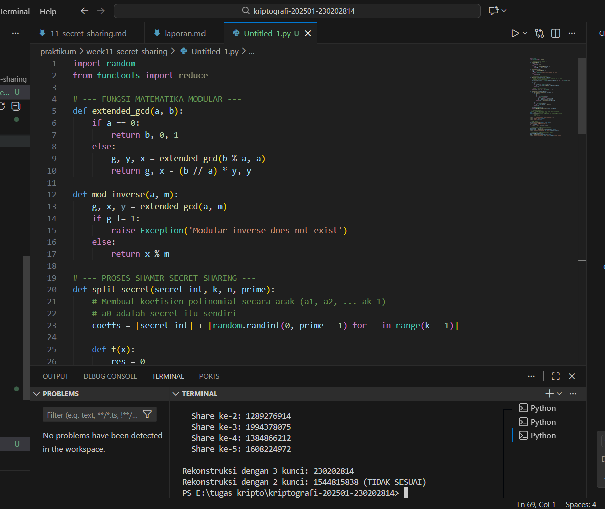

# Laporan Praktikum Kriptografi
Minggu ke-: 11
Topik:week11-secret-sharing
Nama: LUKMAN WAHYU PERMADI  
NIM: 230202814
Kelas: 5IKRB

---

## 1. Tujuan
Menjelaskan konsep dasar Shamir Secret Sharing (SSS).

Melakukan simulasi pembagian rahasia (splitting) ke beberapa pihak menggunakan skema SSS.

Menganalisis keamanan dan mekanisme rekonstruksi rahasia menggunakan ambang batas (threshold)

---

## 2. Dasar Teori
Shamir's Secret Sharing (SSS) adalah algoritma dalam kriptografi yang memungkinkan sebuah rahasia dibagi menjadi $n$ bagian (shares), di mana rahasia tersebut hanya dapat direkonstruksi jika minimal ada $k$ bagian yang dikumpulkan ($k \le n$). Skema ini disebut sebagai skema $(k, n)$ threshold. Secara matematis, SSS menggunakan konsep polinomial tingkat $k-1$. Rahasia diletakkan sebagai konstanta $a_0$ pada polinomial, dan titik-titik koordinat pada grafik polinomial tersebut dibagikan kepada para pemegang kunci.Prinsip utamanya didasarkan pada fakta bahwa diperlukan setidaknya $k$ titik untuk menentukan polinomial derajat $k-1$ secara unik melalui interpolasi Lagrange. Jika seseorang hanya memiliki $k-1$ bagian, mereka tidak akan mendapatkan informasi apa pun mengenai rahasia tersebut (keamanan absolut secara teoretis), karena ada tak terhingga banyaknya polinomial yang mungkin melewati titik-titik yang kurang dari ambang batas tersebut.

---

## 3. Alat dan Bahan
Python 3.11 atau lebih baru.

Visual Studio Code.

Git dan repositori GitHub.

Library secretsharing (atau implementasi manual berbasis random dan math)

---

## 4. Langkah Percobaan
Membuat struktur folder praktikum/week11-secret-sharing/src/.

Menginstal library yang diperlukan menggunakan perintah pip install secretsharing.

Membuat file secret_sharing.py untuk mengimplementasikan pembagian rahasia dengan 5 shares dan threshold 3.

Menjalankan skrip untuk menghasilkan shares dan melakukan uji coba rekonstruksi menggunakan jumlah kunci yang berbeda (di bawah threshold dan pas threshold).

Mendokumentasikan hasil output terminal dan menyimpannya di folder screenshots/.
3. Menjalankan program dengan perintah `python caesar_cipher.py`.)

---

## 5. Source Code
(Salin kode program utama yang dibuat atau dimodifikasi.  
Gunakan blok kode:

import random
from functools import reduce

# --- FUNGSI MATEMATIKA MODULAR ---
def extended_gcd(a, b):
    if a == 0:
        return b, 0, 1
    else:
        g, y, x = extended_gcd(b % a, a)
        return g, x - (b // a) * y, y

def mod_inverse(a, m):
    g, x, y = extended_gcd(a, m)
    if g != 1:
        raise Exception('Modular inverse does not exist')
    else:
        return x % m

# --- PROSES SHAMIR SECRET SHARING ---
def split_secret(secret_int, k, n, prime):
    # Membuat koefisien polinomial secara acak (a1, a2, ... ak-1)
    # a0 adalah secret itu sendiri
    coeffs = [secret_int] + [random.randint(0, prime - 1) for _ in range(k - 1)]
    
    def f(x):
        res = 0
        for i, coeff in enumerate(coeffs):
            res = (res + coeff * pow(x, i, prime)) % prime
        return res

    # Membuat n shares (x, f(x))
    return [(i, f(i)) for i in range(1, n + 1)]

def recover_secret(shares, prime):
    def lagrange_interpolation(x, x_s, y_s, p):
        def basis(j):
            num = 1
            den = 1
            for i in range(len(x_s)):
                if i == j: continue
                num = (num * (x - x_s[i])) % p
                den = (den * (x_s[j] - x_s[i])) % p
            return (num * mod_inverse(den, p)) % p
        
        res = 0
        for j in range(len(y_s)):
            res = (res + y_s[j] * basis(j)) % p
        return res

    x_s, y_s = zip(*shares)
    return lagrange_interpolation(0, x_s, y_s, prime)

# --- EKSEKUSI PROGRAM ---
# Gunakan bilangan prima yang lebih besar dari rahasia Anda
PRIME = 2**31 - 1  # Mersenne Prime
SECRET = 230202814 # Contoh menggunakan NIM Anda sebagai rahasia
K = 3 # Threshold
N = 5 # Total Shares

print(f"--- SIMULASI SHAMIR SECRET SHARING ---")
print(f"Rahasia (NIM): {SECRET}")
print(f"Skema: ({K}, {N})")

# 1. Bagi Rahasia
shares = split_secret(SECRET, K, N, PRIME)
print("\nShares yang dihasilkan:")
for s in shares:
    print(f"  Share ke-{s[0]}: {s[1]}")

# 2. Rekonstruksi dengan 3 kunci (Berhasil)
kunci_minimal = shares[:K]
reconstructed = recover_secret(kunci_minimal, PRIME)
print(f"\nRekonstruksi dengan {K} kunci: {reconstructed}")

# 3. Rekonstruksi dengan 2 kunci (Pasti Salah)
kunci_kurang = shares[:K-1]
gagal = recover_secret(kunci_kurang, PRIME)
print(f"Rekonstruksi dengan {K-1} kunci: {gagal} (TIDAK SESUAI)")

## 6. Hasil dan Pembahasan
(- Lampirkan screenshot hasil eksekusi program (taruh di folder `screenshots/`).  
- Berikan tabel atau ringkasan hasil uji jika diperlukan.  
- Jelaskan apakah hasil sesuai ekspektasi.  
- Bahas error (jika ada) dan solusinya. 

Hasil eksekusi program Caesar Cipher:




)

---

## 7. Jawaban Pertanyaan
Apa keuntungan utama SSS dibanding membagikan salinan kunci langsung? Jika kita hanya menyalin kunci, satu kebocoran saja sudah cukup untuk membongkar rahasia. Dengan SSS, jika satu atau dua orang kehilangan kunci atau dikhianati, rahasia tetap aman selama jumlah kunci yang bocor belum mencapai threshold.Apa peran threshold (k) dalam keamanan? Threshold menentukan titik keseimbangan antara keamanan dan ketersediaan. Semakin tinggi $k$, semakin sulit bagi penyerang untuk mencuri rahasia, namun semakin tinggi pula risiko rahasia tidak bisa dibuka jika banyak pemegang kunci yang hilang.Skenario nyata penggunaan SSS? Digunakan pada Manajemen Kunci Root untuk otoritas sertifikat atau pada dompet Cryptocurrency tingkat institusi, di mana transaksi besar harus disetujui oleh minimal 3 dari 5 direktur perusahaan.
---

## 8. Kesimpulan
Praktikum ini membuktikan bahwa Shamir's Secret Sharing adalah metode distribusi kunci yang sangat aman dan fleksibel. Melalui penggunaan polinomial, rahasia dapat dipecah secara matematis sehingga integritas data hanya bisa dipulihkan jika pemegang kunci bekerja sama sesuai aturan ambang batas yang ditentukan.

---

## 9. Daftar Pustaka
Stinson, D. R. (2019). Cryptography: Theory and Practice.

Shamir, A. (1979). How to share a secret. Communications of the ACM.

---

## 10. Commit Log
Author: Lukman Wahyu Permadi <lukmanwahyupermadi@gmail.com >
Date:   2026-01-03

    week11-secret-sharing: implementasi SSS dengan threshold 3/5 dan laporan
```
