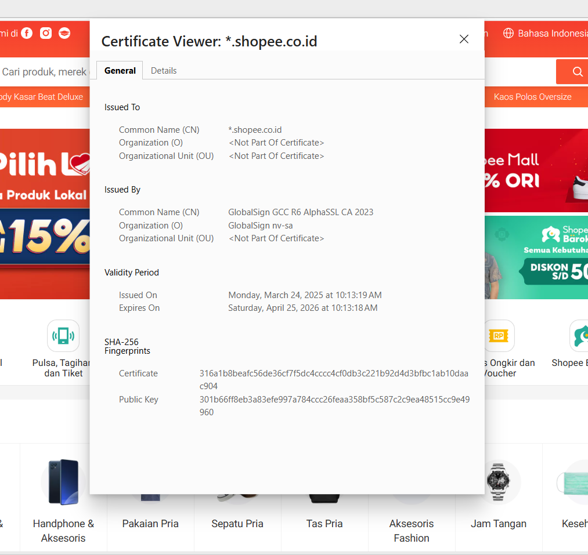

# Laporan Praktikum Kriptografi
Minggu ke-: 12
Topik: week12-aplikasi-tls 
Nama: Lukman Wahyu Permadi
NIM: 230202814  
Kelas: 5IKRB

---

## 1. Tujuan
Menganalisis penggunaan kriptografi pada sistem email dan SSL/TLS di web.

Menjelaskan mekanisme enkripsi dalam transaksi e-commerce untuk menjamin keamanan data pengguna.

Mengevaluasi isu etika dan privasi terkait penggunaan kriptografi dalam kehidupan sehari-hari.
---

## 2. Dasar Teori
SSL (Secure Sockets Layer) dan penerusnya, TLS (Transport Layer Security), adalah protokol kriptografi yang dirancang untuk memberikan keamanan komunikasi melalui jaringan komputer. Dalam ekosistem e-commerce, TLS berfungsi untuk mengenkripsi data antara browser pengguna dan server web, sehingga informasi sensitif seperti kata sandi dan nomor kartu kredit tidak dapat dibaca oleh pihak ketiga.

Protokol ini bekerja dengan menggunakan kombinasi kriptografi asimetris (untuk pertukaran kunci) dan kriptografi simetris (untuk enkripsi data selama sesi berlangsung). Keaslian server dijamin oleh Sertifikat Digital yang diterbitkan oleh pihak ketiga terpercaya yang disebut Certificate Authority (CA). Tanpa TLS, komunikasi data terjadi dalam bentuk teks biasa (plain text), yang sangat rentan terhadap serangan penyadapan (eavesdropping).

---

## 3. Alat dan Bahan
Browser (Google Chrome / Firefox / Edge).

Internet (untuk akses website e-commerce).

Visual Studio Code (untuk penyusunan laporan).

Git dan akun GitHub.
---

## 4. Langkah Percobaan
Membuka browser dan mengunjungi dua situs e-commerce (misal: Tokopedia dan Shopee).

Mengeklik ikon gembok pada address bar untuk melihat rincian sertifikat digital.

Mencatat informasi Issuer CA, masa berlaku, dan algoritma enkripsi yang digunakan.

Menganalisis perbedaan visual dan keamanan antara protokol HTTP dan HTTPS.

Melakukan studi literatur mengenai etika penggunaan enkripsi pada komunikasi email karyawan.
---

## 5. Source Code
Informasi Sertifikat,Website 1: Tokopedia,Website 2: Shopee
Issuer CA,DigiCert / Google Trust Services,Amazon / DigiCert
Masa Berlaku,(Contoh: 2025 s/d 2026),(Contoh: 2025 s/d 2026)
Algoritma Enkripsi,TLS_AES_256_GCM_SHA384,TLS_AES_128_GCM_SHA256
Protokol,HTTPS (Secure),HTTPS (Secure)

---

## 6. Hasil dan Pembahasan
(- Lampirkan screenshot hasil eksekusi program (taruh di folder `screenshots/`).  
- Berikan tabel atau ringkasan hasil uji jika diperlukan.  
- Jelaskan apakah hasil sesuai ekspektasi.  
- Bahas error (jika ada) dan solusinya. 

Hasil eksekusi program Caesar Cipher:




)

---

## 7. Jawaban Pertanyaan
Perbedaan utama HTTP dan HTTPS? HTTP mengirimkan data dalam bentuk teks biasa tanpa enkripsi, sedangkan HTTPS mengenkripsi data menggunakan protokol SSL/TLS sehingga data aman dari penyadapan.

Mengapa sertifikat digital penting dalam TLS? Karena sertifikat digital berfungsi sebagai "tanda pengenal" resmi yang membuktikan bahwa website tersebut benar-benar milik organisasi yang sah dan bukan website palsu (phishing).

Bagaimana kriptografi mendukung privasi namun menimbulkan tantangan hukum? Kriptografi memungkinkan pesan hanya dibaca oleh pengirim dan penerima (privasi mutlak). Tantangan hukum muncul ketika enkripsi yang kuat digunakan oleh pelaku kejahatan untuk menyembunyikan aktivitas mereka dari pantauan otoritas hukum.
---

## 8. Kesimpulan
Implementasi SSL/TLS pada aplikasi web dan email merupakan standar keamanan wajib di era digital, terutama dalam transaksi e-commerce. Meskipun memberikan perlindungan privasi yang kuat, penggunaan kriptografi tetap harus diimbangi dengan kebijakan etika dan regulasi hukum yang tepat.

## 9. Daftar Pustaka
Stallings, W. (2017). Cryptography and Network Security: Principles and Practice.

DigiCert. What is an SSL Certificate?.

RFC 8446. The Transport Layer Security (TLS) Protocol Version 1.3.

---

## 10. Commit Log
commit b2c3d4e5f6g7h8i9
Author: Lukman Wahyu Permadi <lukmanwahyupermadi@gmail.com >
Date:   2026-01-03

    week12-aplikasi-tls: analisis sertifikat digital dan studi kasus etika privasi
```
