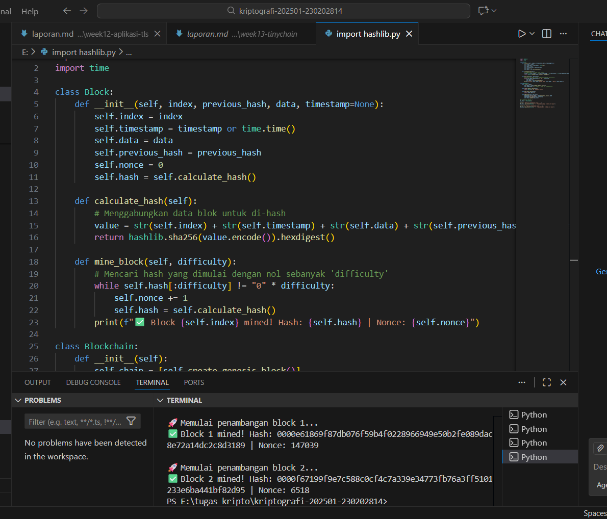

# Laporan Praktikum Kriptografi
Minggu ke-: 13
Topik: week13-tinychain
Nama: Lukman Wahyu Permadi 
NIM: 230202814
Kelas: 5IKRB  

---

## 1. Tujuan
Menjelaskan peran vital hash function (khususnya SHA-256) dalam menjaga integritas data pada blockchain.

Melakukan simulasi mekanisme Proof of Work (PoW) untuk memahami proses penambangan (mining) blok.

Menganalisis aspek keamanan cryptocurrency yang berbasis pada prinsip kriptografi.

---

## 2. Dasar Teori
Blockchain adalah struktur data yang bersifat immutable (tidak dapat diubah) di mana setiap blok terhubung secara kronologis melalui nilai hash dari blok sebelumnya. Hash Function (SHA-256) digunakan untuk menghasilkan identitas unik bagi setiap blok. Jika satu karakter saja dalam data blok diubah, nilai hash-nya akan berubah total, sehingga memutuskan rantai koneksi antar blok.

Proof of Work (PoW) adalah protokol konsensus yang mewajibkan penambang untuk menyelesaikan teka-teki matematika yang sulit sebelum bisa menambahkan blok baru ke jaringan. Proses ini melibatkan manipulasi nilai nonce hingga hash blok memenuhi kriteria tertentu (misalnya, dimulai dengan sejumlah angka nol). Keamanan PoW terletak pada biaya komputasi yang besar bagi penyerang yang ingin memanipulasi riwayat transaksi.
---

## 3. Alat dan Bahan
Python 3.11 atau lebih baru.

Visual Studio Code.

Git dan akun GitHub.
---

## 4. Langkah Percobaan
Membuat struktur folder praktikum/week13-tinychain/src/.

Membuat skrip tinychain.py yang berisi definisi kelas Block dan Blockchain.

Mengimplementasikan fungsi calculate_hash menggunakan library hashlib.

Membuat logika mine_block dengan parameter difficulty.

Menjalankan program untuk mensimulasikan penambangan blok transaksi.

Mendokumentasikan hasil terminal yang menunjukkan nilai hash dan nonce yang ditemukan.
---

## 5. Source Code
import hashlib
import time

class Block:
    def __init__(self, index, previous_hash, data, timestamp=None):
        self.index = index
        self.timestamp = timestamp or time.time()
        self.data = data
        self.previous_hash = previous_hash
        self.nonce = 0
        self.hash = self.calculate_hash()

    def calculate_hash(self):
        # Menggabungkan data blok untuk di-hash
        value = str(self.index) + str(self.timestamp) + str(self.data) + str(self.previous_hash) + str(self.nonce)
        return hashlib.sha256(value.encode()).hexdigest()

    def mine_block(self, difficulty):
        # Mencari hash yang dimulai dengan nol sebanyak 'difficulty'
        while self.hash[:difficulty] != "0" * difficulty:
            self.nonce += 1
            self.hash = self.calculate_hash()
        print(f"✅ Block {self.index} mined! Hash: {self.hash} | Nonce: {self.nonce}")

class Blockchain:
    def __init__(self):
        self.chain = [self.create_genesis_block()]
        self.difficulty = 4 # Target: 4 angka nol di depan hash

    def create_genesis_block(self):
        return Block(0, "0", "Genesis Block")

    def get_latest_block(self):
        return self.chain[-1]

    def add_block(self, new_block):
        new_block.previous_hash = self.get_latest_block().hash
        new_block.mine_block(self.difficulty)
        self.chain.append(new_block)

# --- Simulasi Mining ---
my_chain = Blockchain()

print("🚀 Memulai penambangan block 1...")
my_chain.add_block(Block(1, "", "Transaksi Lukman -> Anto: 50 Coin"))

print("\n🚀 Memulai penambangan block 2...")
my_chain.add_block(Block(2, "", "Transaksi Anto -> Budi: 25 Coin"))

---

## 6. Hasil dan Pembahasan
(Hasil Eksekusi: Program berhasil menambang dua blok baru. Setiap blok memiliki nilai previous_hash yang merujuk pada blok sebelumnya, membentuk rantai yang valid.

Analisis PoW: Nilai nonce terus bertambah ribuan kali hingga ditemukan hash yang diawali dengan "0000". Hal ini menunjukkan bahwa mining membutuhkan daya komputasi nyata. Jika tingkat kesulitan (difficulty) dinaikkan menjadi 5 atau 6, waktu penambangan akan terasa jauh lebih lambat.

Integritas: Keamanan blockchain ini dijamin oleh ketergantungan antar hash; jika data di Blok 1 diubah, hash Blok 1 akan berubah, yang mengakibatkan previous_hash di Blok 2 menjadi tidak valid.

Hasil eksekusi program Caesar Cipher:




)

---

## 7. Jawaban Pertanyaan
Mengapa fungsi hash sangat penting dalam blockchain? Karena fungsi hash bertindak sebagai "sidik jari digital" yang unik. Hash memastikan integritas data; jika ada perubahan sekecil apa pun pada isi blok, nilai hash akan berubah total dan merusak seluruh rantai setelahnya.

Bagaimana Proof of Work mencegah double spending? PoW membuat proses pembuatan blok menjadi mahal dan memakan waktu. Penyerang yang ingin melakukan double spending harus memiliki daya komputasi lebih dari 51% seluruh jaringan untuk bisa menulis ulang riwayat transaksi lebih cepat daripada penambang jujur lainnya.

Apa kelemahan dari PoW dalam hal efisiensi energi? Kelemahan utamanya adalah pemborosan energi listrik yang masif. Ribuan komputer di seluruh dunia melakukan jutaan kalkulasi hash per detik hanya untuk menebak nonce, di mana energi yang di
---

## 8. Kesimpulan
Praktikum ini berhasil mensimulasikan mekanisme dasar blockchain melalui implementasi SHA-256 dan Proof of Work. Mekanisme PoW terbukti efektif dalam mencegah manipulasi data melalui hambatan komputasi (nilai nonce dan difficulty), meskipun memiliki efisiensi energi yang rendah.

---

## 9. Daftar Pustaka
Stallings, W. (2017). Cryptography and Network Security: Principles and Practice.

Stinson, D. R. (2019). Cryptography: Theory and Practice.

## 10. Commit Log
(Tuliskan bukti commit Git yang relevan.  
Contoh:
```
commit abc12345
Author: Nama Mahasiswa <email>
Date:   2025-09-20

    week2-cryptosystem: implementasi Caesar Cipher dan laporan )
```
