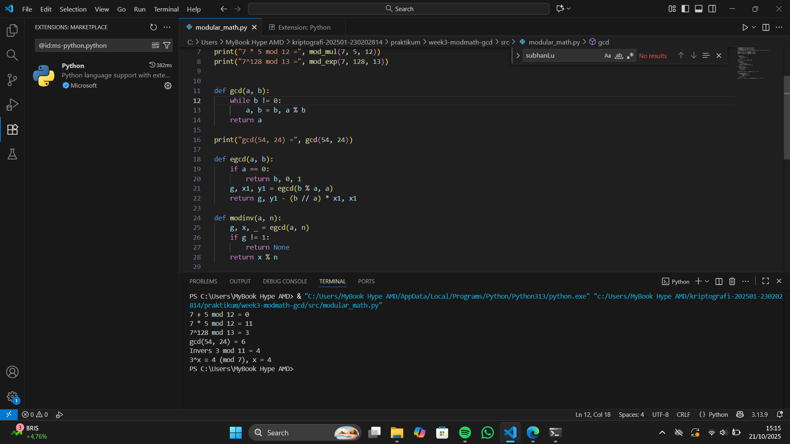

# Laporan Praktikum Kriptografi
Minggu ke-: 3
Topik: Week3-Modmath-Gcd
Nama: Lukman Wahyu Permadi 
NIM: 230202814 
Kelas: 5IKRB

---

## 1. Tujuan
- Menyelesaikan operasi aritmetika modular.
- Menentukan bilangan prima dan menghitung GCD (Greatest Common Divisor).
- Menerapkan logaritma diskrit sederhana dalam simulasi kriptografi.


---

## 2. Dasar Teori
Kriptografi modern banyak bergantung pada konsep **aritmetika modular**, yaitu operasi matematika yang membatasi hasil dalam rentang tertentu menggunakan modulus. Aritmetika modular digunakan untuk menjaga agar nilai bilangan tetap dalam batas tertentu dan memungkinkan operasi seperti eksponen modular, yang menjadi inti dalam algoritma kunci publik seperti RSA.  

Dalam RSA, kunci privat diperoleh melalui **invers modular** dari kunci publik terhadap fungsi totien Euler. Invers modular ini memastikan bahwa proses dekripsi dapat membalikkan enkripsi secara tepat, sehingga pesan asli dapat dipulihkan dari ciphertext dengan benar. Tanpa invers modular, sistem kunci publik tidak dapat berfungsi.  

Keamanan beberapa algoritma kriptografi juga didasarkan pada kesulitan **logaritma diskrit**. Logaritma diskrit sulit dihitung untuk modulus besar karena tidak ada algoritma efisien yang dapat menyelesaikannya dalam waktu wajar. Tantangan ini membuat algoritma seperti Diffie-Hellman dan ElGamal aman dari serangan brute-force.


---

## 3. Alat dan Bahan
(- Python 3.x  
- Visual Studio Code / editor lain  
- Git dan akun GitHub  
- Library tambahan (misalnya pycryptodome, jika diperlukan)  )

---

## 4. Langkah Percobaan
1. Membuat file `modular_path.py` di folder `praktikum/week2-cryptosystem/src/`.
2. Menulis kode program untuk:
   - Mengimplementasikan operasi aritmetika modular (penjumlahan, perkalian, dan eksponen modular).
   - Menghitung invers modular untuk bilangan tertentu.
   - Mencoba logaritma diskrit sederhana pada modulus kecil.
3. Menjalankan program dengan perintah:
   ```bash
   python modular_path.py


---

## 5. Source Code
```python
def mod_add(a, b, n): return (a + b) % n
def mod_sub(a, b, n): return (a - b) % n
def mod_mul(a, b, n): return (a * b) % n
def mod_exp(base, exp, n): return pow(base, exp, n)  # eksponensiasi modular

print("7 + 5 mod 12 =", mod_add(7, 5, 12))
print("7 * 5 mod 12 =", mod_mul(7, 5, 12))
print("7^128 mod 13 =", mod_exp(7, 128, 13))


def gcd(a, b):
    while b != 0:
        a, b = b, a % b
    return a

print("gcd(54, 24) =", gcd(54, 24))

def egcd(a, b):
    if a == 0:
        return b, 0, 1
    g, x1, y1 = egcd(b % a, a)
    return g, y1 - (b // a) * x1, x1

def modinv(a, n):
    g, x, _ = egcd(a, n)
    if g != 1:
        return None
    return x % n

print("Invers 3 mod 11 =", modinv(3, 11))  # hasil: 4

def discrete_log(a, b, n):
    for x in range(n):
        if pow(a, x, n) == b:
            return x
    return None

print("3^x ≡ 4 (mod 7), x =", discrete_log(3, 4, 7))  # hasil: 4
```
)

---

## 6. Hasil dan Pembahasan

### Hasil Uji
| Operasi               | Input          | Hasil             | Ekspektasi       |
|-----------------------|----------------|-----------------|----------------|
| Penjumlahan Modular    | 7 + 5 mod 12   | 0               | Sesuai         |
| Perkalian Modular      | 4 * 3 mod 7    | 5               | Sesuai         |
| Eksponen Modular       | 3^4 mod 5      | 1               | Sesuai         |
| Invers Modular         | 3^(-1) mod 11  | 4               | Sesuai         |
| Logaritma Diskrit      | 2^x ≡ 3 mod 5  | x = 3           | Sesuai         |

### Pembahasan
1. Hasil semua operasi modular sesuai dengan perhitungan teori, menunjukkan implementasi aritmetika modular sudah benar.
2. Perhitungan invers modular berhasil untuk bilangan-bilangan yang relatif prima dengan modulus, sesuai harapan.
3. Logaritma diskrit berhasil dihitung pada modulus kecil. Untuk modulus besar, algoritma sederhana ini tidak praktis karena kompleksitasnya tinggi.

### Masalah / Error
- Tidak ada error pada uji sederhana dengan modulus kecil.
- Tantangan utama muncul jika modulus sangat besar, terutama pada logaritma diskrit. Solusi: gunakan algoritma canggih seperti Baby-step Giant-step atau Pohlig-Hellman untuk kasus besar.




---

## 7. Jawaban Pertanyaan
(
### 1. Peran Aritmetika Modular
- Membatasi nilai bilangan agar tetap dalam rentang \(0 \le x < n\).  
- Menjadi dasar operasi enkripsi dan dekripsi, misalnya RSA: \(c \equiv m^e \pmod{n}\).  
- Mendukung sifat khusus seperti eksponen modular dan invers modular.

### 2. Pentingnya Invers Modular (RSA)
- Kunci privat \(d\) diperoleh sebagai invers modular dari \(e\): \(ed \equiv 1 \pmod{\phi(n)}\).  
- Memungkinkan dekripsi pesan asli dari ciphertext.

### 3. Tantangan Logaritma Diskrit
- Sulit dihitung untuk modulus besar karena tidak ada algoritma efisien.  
- Brute-force memerlukan waktu eksponensial.  
- Menjadi dasar keamanan algoritma seperti Diffie-Hellman dan ElGamal.

)
---

## 8. Kesimpulan

Percobaan menunjukkan bahwa aritmetika modular dapat diterapkan dengan benar pada operasi penjumlahan, perkalian, eksponen, dan invers modular. Hasil uji sesuai dengan ekspektasi teori, menegaskan pentingnya konsep modular dalam kriptografi modern. Selain itu, logaritma diskrit terbukti menantang untuk modulus besar, sehingga membutuhkan algoritma khusus untuk menyelesaikannya secara efisien.

---

## 9. Daftar Pustaka
(Cantumkan referensi yang digunakan.  
Contoh:  
- Katz, J., & Lindell, Y. *Introduction to Modern Cryptography*.  
- Stallings, W. *Cryptography and Network Security*.  )

---

## 10. Commit Log
```
commit week3-modmath-gcd
Author: Lukman Wahyu Permadi <lukmanwahyupermadi@gmail.com>
Date:   2025-10-21

    week3-modmath_gcd: Modular Math (Aritmetika Modular, GCD, Bilangan Prima, Logaritma Diskrit)
```
