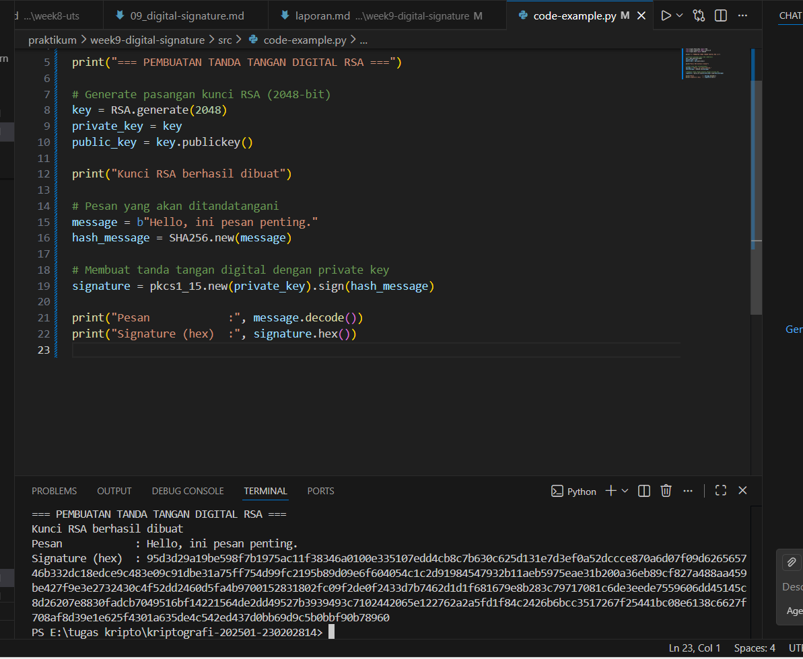

# Laporan Praktikum Kriptografi
Minggu ke-: 9
Topik: Week 9 – Digital Signature (RSA)
Nama: LUKMAN WAHYU PERMADI
NIM:  230202814
Kelas: 5IKRA 

---

## 1. Tujuan
Tujuan Pembelajaran

Setelah mengikuti praktikum ini, mahasiswa diharapkan mampu:

Mengimplementasikan tanda tangan digital menggunakan algoritma kriptografi kunci publik seperti RSA atau DSA.

Melakukan proses verifikasi tanda tangan digital untuk memastikan keaslian pengirim dan keabsahan pesan.

Menjelaskan peran dan manfaat tanda tangan digital dalam menjamin otentikasi pesan serta integritas data pada sistem komunikasi digital.

## 2. Dasar Teori
1. Tanda Tangan Digital

Tanda tangan digital (digital signature) merupakan mekanisme kriptografi yang digunakan untuk menjamin keaslian pengirim (authentication), keutuhan data (integrity), dan nir-sangkal (non-repudiation) dalam komunikasi digital. Berbeda dengan tanda tangan konvensional, tanda tangan digital dibuat menggunakan algoritma matematika dan kunci kriptografi.

Tanda tangan digital tidak bertujuan untuk menyembunyikan isi pesan, melainkan untuk memastikan bahwa pesan benar-benar berasal dari pihak yang sah dan tidak mengalami perubahan selama proses pengiriman.
## 3. Alat dan Bahan
(from Crypto.PublicKey import RSA
from Crypto.Signature import pkcs1_15
from Crypto.Hash import SHA256

print("=== PEMBUATAN TANDA TANGAN DIGITAL RSA ===")

# Generate pasangan kunci RSA (2048-bit)
key = RSA.generate(2048)
private_key = key
public_key = key.publickey()

print("Kunci RSA berhasil dibuat")

# Pesan yang akan ditandatangani
message = b"Hello, ini pesan penting."
hash_message = SHA256.new(message)

# Membuat tanda tangan digital dengan private key
signature = pkcs1_15.new(private_key).sign(hash_message)

print("Pesan            :", message.decode())
print("Signature (hex)  :", signature.hex())

---

## 4. Langkah Percobaan
praktikum/week9-digital-signature/
├─ src/
├─ screenshots/
└─ laporan.md


## 5. Source Code
from Crypto.PublicKey import RSA
from Crypto.Signature import pkcs1_15
from Crypto.Hash import SHA256

print("=== PEMBUATAN TANDA TANGAN DIGITAL RSA ===")

# Generate pasangan kunci RSA (2048-bit)
key = RSA.generate(2048)
private_key = key
public_key = key.publickey()

print("Kunci RSA berhasil dibuat")

# Pesan yang akan ditandatangani
message = b"Hello, ini pesan penting."
hash_message = SHA256.new(message)

# Membuat tanda tangan digital dengan private key
signature = pkcs1_15.new(private_key).sign(hash_message)

print("Pesan            :", message.decode())
print("Signature (hex)  :", signature.hex())

## 6. Hasil dan Pembahasan
(- Lampirkan screenshot hasil eksekusi program (taruh di folder `screenshots/`).  
- Berikan tabel atau ringkasan hasil uji jika diperlukan.  
- Jelaskan apakah hasil sesuai ekspektasi.  
- Bahas error (jika ada) dan solusinya. 

Hasil eksekusi program Caesar Cipher:




---

## 7. Jawaban Pertanyaan
(Jawab pertanyaan diskusi yang diberikan pada modul.  
- Pertanyaan 1: …  
- Pertanyaan 2: …  
)
---

## 8. Kesimpulan
(Tuliskan kesimpulan singkat (2–3 kalimat) berdasarkan percobaan.  )

---

## 9. Daftar Pustaka
(Cantumkan referensi yang digunakan.  
Contoh:  
- Katz, J., & Lindell, Y. *Introduction to Modern Cryptography*.  
- Stallings, W. *Cryptography and Network Security*.  )

---

## 10. Commit Log
(Tuliskan bukti commit Git yang relevan.  
Contoh:
```
commit abc12345
Author: Nama Mahasiswa <email>
Date:   2025-09-20

    week2-cryptosystem: implementasi Caesar Cipher dan laporan )
```
